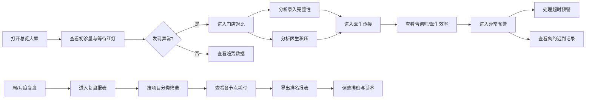

## 1. 产品概述

医美初诊分诊数据驾驶舱，为连锁医美机构运营经理提供数据化运营决策支持。聚焦新客转化、接诊效率和分诊质量三大核心维度，通过6大功能模块实现全链路数据可视化与智能预警，赋能运营精细化管理。

- **核心目标**：解决连锁门店运营数据分散、决策依赖经验、异常问题发现滞后的痛点
- **目标用户**：连锁医美机构运营经理、店总
- **市场价值**：提升新客转化率15%+，缩短平均等待时长30%，降低分诊改派率

## 2. 核心功能

### 2.1 用户角色

| 角色 | 登录方式 | 核心权限 |
|------|----------|----------|
| 运营经理 | 账号密码登录 | 查看所有门店数据、导出报表、设置预警阈值 |
| 门店店长 | 账号密码登录 | 查看所属门店数据、处理预警、导出本店报表 |

### 2.2 功能模块

1. **总览大屏**：全店核心指标概览、实时等待红灯预警、关键趋势一目了然
2. **门店对比**：多门店横向对比、前台录入质量评估、医生积压分析
3. **医生承接**：医生接诊量统计、初诊承接效率、咨询师接待能力分析
4. **项目热度**：项目意向分布、渠道来源拆分、成交前置路径追踪
5. **异常预警**：超时未接诊预警、爽约迟到标记、分诊改派异常监控
6. **复盘报表**：按项目分类查看节点耗时、门店排名导出、排班优化建议

### 2.3 页面详情

| 页面名称 | 模块名称 | 功能描述 |
|----------|----------|----------|
| 总览大屏 | KPI指标卡 | 今日初诊量、平均等待时长、分诊改派次数、风险问卷完成率 |
| 总览大屏 | 等待红灯监控 | 实时显示等待超时顾客，分门店标注预警等级 |
| 总览大屏 | 趋势折线图 | 近7天/30天初诊量、转化率趋势对比 |
| 总览大屏 | 渠道来源分布 | 饼图展示各渠道新客占比 |
| 门店对比 | 门店排名表 | 按初诊量、转化率、等待时长等指标排序，支持导出 |
| 门店对比 | 录入完整性分析 | 各门店前台资料录入完整率、必填项缺失统计 |
| 门店对比 | 医生积压对比 | 各门店医生待接诊人数、平均接诊时长对比 |
| 医生承接 | 咨询师接待榜 | 咨询师接待量、平均沟通时长、转介成功率 |
| 医生承接 | 医生接诊热力图 | 按时间段展示医生接诊分布，识别高峰时段 |
| 医生承接 | 初诊承接效率 | 医生平均接诊时长、复诊率、顾客满意度 |
| 项目热度 | 项目意向雷达图 | 鼻整形、眼整形、皮肤光电等项目意向分布 |
| 项目热度 | 成交路径分析 | 顾客从签到→分诊→面诊→成交的转化漏斗 |
| 项目热度 | 项目分类筛选 | 按"鼻整形初诊""皮肤光电初诊"等分类筛选 |
| 异常预警 | 超时未接诊列表 | 等待时长>30分钟顾客清单，支持一键推送提醒 |
| 异常预警 | 爽约迟到记录 | 本周爽约/迟到顾客统计，标记高风险顾客 |
| 异常预警 | 分诊改派监控 | 改派次数异常的咨询师/医生列表 |
| 复盘报表 | 节点耗时分析 | 签到→分诊→咨询师→医生各环节平均耗时 |
| 复盘报表 | 排班优化建议 | 根据历史数据智能推荐高峰时段排班方案 |
| 复盘报表 | 导诊话术分析 | 不同话术下的转化率对比，推荐最优话术 |

## 3. 核心流程

运营经理每日工作流程：打开总览大屏查看各门店初诊量和等待红灯→发现异常门店进入门店对比模块→分析前台录入完整性和医生积压情况→查看医生承接模块了解接诊效率→异常预警模块处理超时未接诊问题→周/月度复盘时使用复盘报表按项目分类查看节点耗时→导出门店排名报表→调整排班和导诊话术。

## 4. 用户界面设计

### 4.1 设计风格

- **主色调**：医疗科技蓝 `#165DFF`（专业、信任），配合玫瑰金 `#E8A87C`（医美、优雅）
- **辅助色**：预警红 `#F53F3F`、成功绿 `#00B42A`、警示橙 `#FF7D00`、信息紫 `#722ED1`
- **背景色**：深空灰渐变 `#0F172A` → `#1E293B`（数据大屏沉浸感）
- **字体**：显示字体 `Noto Sans SC Bold`，正文字体 `Noto Sans SC Regular`，数字字体 `JetBrains Mono`
- **布局风格**：卡片式布局，圆角8px，玻璃拟态背景，精致阴影
- **图标风格**：线性+填充结合，医疗行业专属图标
- **动效**：数字滚动动画、卡片悬浮抬升、数据加载骨架屏、预警脉冲闪烁

### 4.2 页面设计概览

| 页面名称 | 模块名称 | UI元素 |
|----------|----------|--------|
| 总览大屏 | KPI指标卡 | 渐变背景、数字滚动动画、环比指标箭头、趋势迷你图 |
| 总览大屏 | 等待红灯 | 红色脉冲动画、倒计时显示、门店标签、一键处理按钮 |
| 总览大屏 | 趋势图表 | 双Y轴折线图、区域渐变填充、数据点悬浮提示 |
| 门店对比 | 对比表格 | 斑马纹、排名徽章、进度条可视化、排序箭头 |
| 门店对比 | 录入分析 | 环形进度图、缺失项列表、颜色分级标识 |
| 医生承接 | 热力图 | 色块颜色深浅表示接诊量、悬浮显示详情 |
| 项目热度 | 雷达图 | 多维度对比、填充渐变、动画呈现 |
| 异常预警 | 预警列表 | 严重程度颜色分级、处理状态标签、倒计时 |
| 复盘报表 | 漏斗图 | 转化漏斗、各环节转化率标注、流失点高亮 |

### 4.3 响应式

- **桌面优先**：1920px最佳显示，支持1440px-2560px自适应
- **侧边栏导航**：左侧固定240px导航，支持折叠为80px图标模式
- **数据看板**：使用Grid布局自动适配列数，大屏显示4列，中小屏显示2-3列
- **图表自适应**：ECharts图表自动监听容器尺寸变化并重绘

### 4.4 数据大屏设计要点

- 顶部状态栏：实时时间、门店总数、在线医生数、今日已接诊数
- 左侧导航：6大模块入口，当前选中高亮，徽标显示未处理预警数
- 主内容区：响应式卡片网格，支持拖拽调整卡片位置
- 底部数据条：滚动展示实时到诊信息
- 沉浸体验：深色背景降低眼部疲劳，高亮数据吸引注意力
