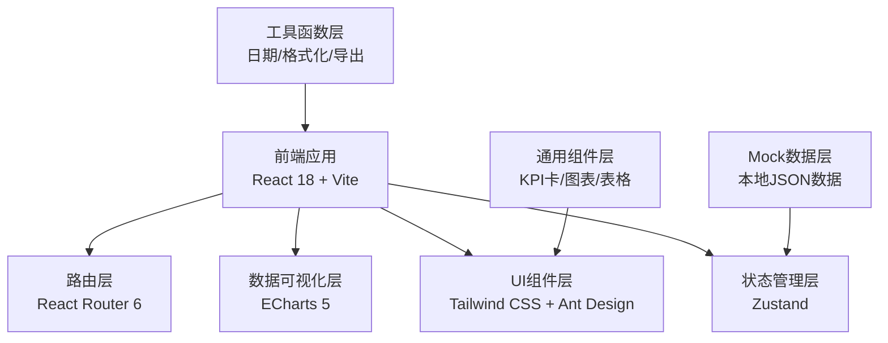
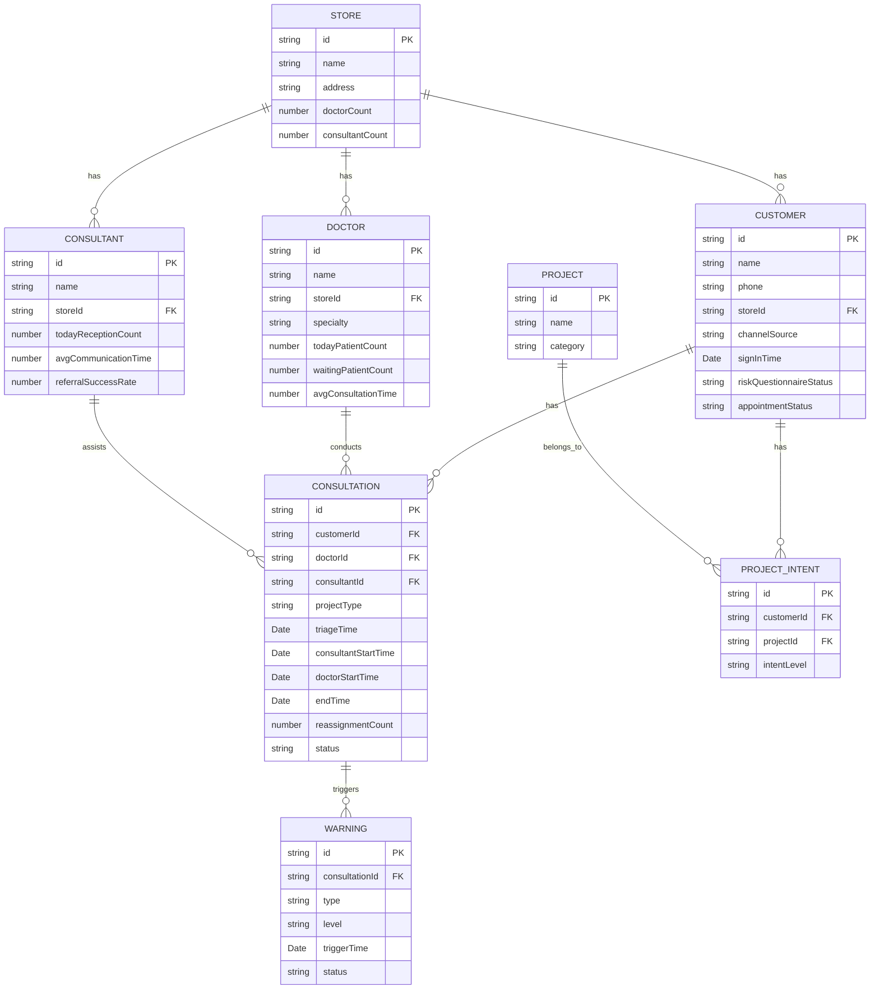

## 1. 架构设计



## 2. 技术描述

- **前端框架**：React@18.2.0 + TypeScript
- **构建工具**：Vite@5.0.0
- **样式方案**：Tailwind CSS@3.4.0
- **UI组件库**：Ant Design@5.12.0
- **数据可视化**：ECharts@5.4.3
- **状态管理**：Zustand@4.4.7
- **路由管理**：React Router DOM@6.20.0
- **图标库**：@ant-design/icons@5.2.6
- **数据导出**：xlsx@0.18.5
- **Mock数据**：本地TypeScript数据文件，模拟真实业务场景
- **日期处理**：dayjs@1.11.10
- **数字动画**：countup.js@2.8.0

## 3. 路由定义

| 路由 | 页面 | 说明 |
|------|------|------|
| / | 总览大屏 | 默认首页，核心指标概览 |
| /overview | 总览大屏 | 核心KPI、等待红灯、趋势图表 |
| /store-compare | 门店对比 | 多门店横向对比分析 |
| /doctor | 医生承接 | 医生与咨询师效率分析 |
| /project | 项目热度 | 项目意向与成交路径 |
| /warning | 异常预警 | 超时预警与异常监控 |
| /report | 复盘报表 | 节点耗时分析与报表导出 |

## 4. 目录结构

```
src/
├── assets/             # 静态资源
├── components/         # 通用组件
│   ├── KpiCard.tsx     # KPI指标卡组件
│   ├── Layout.tsx      # 布局组件
│   ├── Sidebar.tsx     # 侧边导航
│   ├── Header.tsx      # 顶部状态栏
│   └── charts/         # 图表组件
│       ├── LineChart.tsx
│       ├── PieChart.tsx
│       ├── BarChart.tsx
│       ├── RadarChart.tsx
│       ├── FunnelChart.tsx
│       └── HeatmapChart.tsx
├── pages/              # 页面组件
│   ├── Overview.tsx    # 总览大屏
│   ├── StoreCompare.tsx # 门店对比
│   ├── Doctor承接.tsx  # 医生承接
│   ├── ProjectHot.tsx  # 项目热度
│   ├── Warning.tsx     # 异常预警
│   └── Report.tsx      # 复盘报表
├── store/              # 状态管理
│   └── useDataStore.ts
├── mock/               # Mock数据
│   ├── overview.ts
│   ├── stores.ts
│   ├── doctors.ts
│   ├── projects.ts
│   ├── warnings.ts
│   └── reports.ts
├── utils/              # 工具函数
│   ├── format.ts
│   ├── export.ts
│   └── date.ts
├── types/              # TypeScript类型定义
│   └── index.ts
├── App.tsx
├── main.tsx
└── index.css
```

## 5. 数据模型

### 5.1 数据模型ER图



### 5.2 核心数据类型定义

```typescript
// 门店数据
interface Store {
  id: string;
  name: string;
  todayNewCustomers: number;
  avgWaitTime: number;
  dataCompleteness: number;
  conversionRate: number;
  doctorBacklog: number;
  reassignmentCount: number;
}

// KPI指标
interface KpiData {
  title: string;
  value: number;
  unit: string;
  trend: number;
  trendType: 'up' | 'down';
  miniChartData: number[];
}

// 等待顾客
interface WaitingCustomer {
  id: string;
  name: string;
  storeName: string;
  waitTime: number;
  projectType: string;
  status: 'normal' | 'warning' | 'danger';
}

// 医生数据
interface Doctor {
  id: string;
  name: string;
  storeName: string;
  specialty: string;
  todayPatients: number;
  waitingPatients: number;
  avgConsultationTime: number;
  satisfaction: number;
}

// 咨询师数据
interface Consultant {
  id: string;
  name: string;
  storeName: string;
  todayReceptions: number;
  avgCommunicationTime: number;
  referralSuccessRate: number;
}

// 项目意向
interface ProjectIntent {
  name: string;
  category: string;
  intentCount: number;
  conversionRate: number;
  avgPrice: number;
}

// 预警数据
interface WarningItem {
  id: string;
  type: 'timeout' | 'missed' | 'late' | 'reassignment';
  level: 'high' | 'medium' | 'low';
  customerName: string;
  storeName: string;
  content: string;
  triggerTime: Date;
  status: 'pending' | 'processing' | 'resolved';
}

// 复盘节点数据
interface NodeTimeData {
  node: string;
  avgTime: number;
  projectType: string;
  comparison: number;
}
```

## 6. 前端关键技术方案

### 6.1 数据大屏布局方案

- 使用 CSS Grid 实现自适应网格布局
- 左侧固定侧边栏导航，宽度240px，支持折叠
- 顶部固定状态栏，高度64px，显示实时数据
- 主内容区使用 `grid-template-columns: repeat(auto-fit, minmax(300px, 1fr))` 实现自适应

### 6.2 图表组件封装

- 基于 ECharts 封装通用图表组件
- 支持深色主题配置
- 自动响应容器尺寸变化
- 统一配置动画效果和交互

### 6.3 数字滚动动画

- 使用 countup.js 实现KPI数字滚动效果
- 页面加载时按顺序动画呈现
- 支持千分位格式化和单位显示

### 6.4 预警脉冲动画

- 使用 CSS `@keyframes` 实现呼吸灯效果
- 根据预警等级显示不同颜色（红/橙/黄）
- 支持点击处理后动画消失

### 6.5 数据导出功能

- 使用 xlsx 库实现 Excel 导出
- 支持多Sheet导出
- 支持自定义表头和数据格式化

## 7. 性能优化

- React.memo 优化组件重渲染
- 使用 useMemo/useCallback 缓存计算结果和回调
- 图表数据延迟加载和懒渲染
- 路由组件代码分割
- 使用 React 18 并发特性优化大列表渲染
